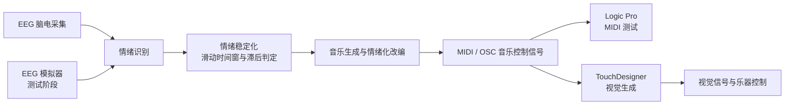
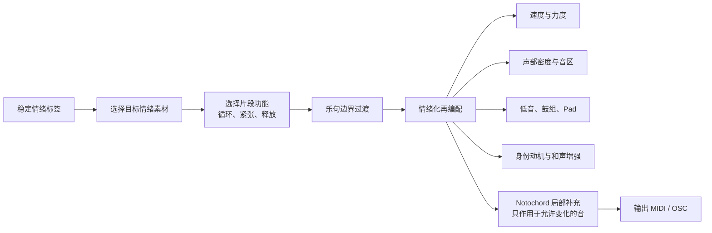

# BCI 情绪驱动音乐与视觉交互系统：算法总体描述

## 1. 系统总体技术路径

本系统面向脑机接口（BCI）驱动的音乐与视觉交互场景。系统以 EEG 脑电信号为输入，将其转换为情绪状态，再据此实时生成或改编符号音乐，最后将音乐控制信号发送至视觉系统和乐器系统，形成“脑电—情绪—音乐—视觉—乐器”的交互闭环。

系统首先通过 EEG 设备采集脑电信号。在测试阶段，为了保证开发和调试的可重复性，系统使用 EEG 模拟器持续发送模拟的情绪数据。情绪数据主要包含效价（Valence）、唤醒度（Arousal）及其置信度，并被映射为愉悦、平静、中性、紧张和悲伤五种基础情绪标签。

由于脑电信号具有波动性，系统不会直接根据单次输入改变音乐，而是通过滑动时间窗对连续样本进行置信度加权聚合，并采用滞后判定机制确认情绪是否稳定。当新的情绪标签连续出现时，系统才在合适的乐句边界触发音乐变化；当置信度很高且情绪变化显著时，则允许更快地完成切换。

音乐生成完成后，系统可以通过两种方式输出：一是将 MIDI 信号输出至 Logic Pro，用于测试音乐结构、音色和演奏效果；二是通过 OSC 将音乐事件和控制参数发送至 TouchDesigner，驱动实时视觉生成。TouchDesigner 根据速度、力度、音高、声部密度和情绪类别等信息生成视觉信号，并进一步与乐器演奏或装置控制相连接。

## 2. 算法设计

本系统采用两条互补的音乐算法路径：第一条从短小动机出发，逐步生成具有发展性的音乐；第二条以预先创作的音乐片段为基础，根据情绪信号进行实时改编。两条路径均以稳定化后的 EEG 情绪标签为输入，并最终输出可发送至 MIDI、OSC、TouchDesigner 或乐器控制系统的音乐事件。

### 2.1 基于动机的渐进式音乐生成

动机是短小、可辨识的旋律或节奏单元，也是音乐身份的核心。系统以动机为起点，在调式、和声、音域、节奏和乐器角色等规则约束下，对音乐进行逐步展开，而不是完全随机地从零生成旋律。

首先，系统根据当前情绪选择适合的动机或主题素材，并保留其中的关键音、重拍位置和不可变节奏点，以确保不同版本之间仍具有可辨识的共同身份。随后，系统根据情绪对动机进行受约束的变化，包括音高移动、八度调整、音符删减、节奏压缩或延展、力度调整，以及旋律织体扩展。

在声部层面，主旋律负责维持动机身份；和声与低音根据调性和和弦进行提供基础；鼓组和镲片主要响应唤醒度变化；Pad 等持续声部则用于维持空间感与情绪氛围。高唤醒状态下，音乐通常具有更高的速度、节奏密度和力度；低唤醒状态下，音符时值更长、配器更稀疏、节奏活动更少。

系统进一步将短音乐片段组织为引子、主题呈示、变化、发展、高潮、回归和尾声等段落。这样，动机不会只是机械循环，而能够在音乐结构中逐渐展开。在情绪即将变化时，算法可在乐句末尾加入低音经过音、鼓点填充或力度收束，以帮助下一段自然衔接。

Notochord 作为受约束的局部辅助工具参与该路径。规则系统先确定主题旋律、关键重拍、和声框架和段落结构，Notochord 只在旋律空隙、可变和声音或局部装饰位置生成候选音。其候选音必须符合当前调式、乐器音域和和弦约束，不允许改变主题锚点、终止音或基础和声；若推理超时、模型不可用或结果不满足约束，系统立即回退到规则生成结果。

### 2.2 基于预设音乐的情绪化改编

除实时生成外，系统还支持以预先创作的 MIDI 音乐片段为基础，根据用户当前情绪进行再编配。预设素材保留已经完成的旋律、节奏、和声和音色组织，因此具有更稳定的音乐质量；情绪算法则决定这些素材以何种方式被演奏。

每种情绪可对应若干不同功能的片段，例如循环、紧张和释放。当稳定情绪发生变化时，系统不会立即打断当前音乐，而是在一个乐句完成后，先进入释放或过渡片段，再切换到目标情绪对应的新素材。这种方法能够避免音乐结构被突然切断。

预设音乐的改编主要包括：

- **速度控制**：不同情绪对应不同目标速度，并限制相邻片段之间的速度变化幅度。
- **配器密度控制**：悲伤状态减少节奏声部，平静状态保持稀疏织体，愉悦和紧张状态增强低音与打击乐。
- **力度与音区控制**：利用唤醒度和效价调整各声部的力度、亮度与音区重心。
- **统一身份动机**：在乐句末尾加入简短的识别性音型，使不同情绪版本仍具有共同的音乐身份。
- **和声增强**：在不改变原始主旋律的前提下，补充和声音或分解和弦。
- **原始演奏保护**：对于具有复调演奏特征的 MIDI 素材，尽量保留其原始多声部结构，避免过度单音化而损失音乐性。

Notochord 同样可以嵌入预设改编路径，但其职责不是重写预设音乐，而是在不改变原始核心旋律和固定结构的前提下，对少量允许修改的位置进行局部补充。例如，它可以为已有和声重新选择部分邻近音，或在主旋律之间补充符合和弦和调式的装饰音。系统会校验 Notochord 输出是否改变了预设素材中的不可变音符；一旦发现不符合约束，便舍弃该结果并使用原始预设版本。

因此，这一路径的核心思想是“以改编替代重写”：预设音乐提供可靠的审美质量和结构完整性，情绪算法决定其速度、密度、力度、织体和段落功能，Notochord 则仅在受控范围内增加局部变化。

## 3. 当前限制与问题

本系统目前的限制主要来自两个方面。

第一，BCI 情绪信号本身仍不够稳定。脑电采集结果容易受到个体状态、动作、环境和佩戴情况的影响；同时，音乐播放和交互过程也可能反过来对 EEG 采集产生噪声或干扰。目前传递给音乐系统的信息主要是较为抽象的情绪标签及其置信度，而非更丰富、连续且高分辨率的心理状态表达。这限制了音乐系统对细微情绪变化的理解能力，也限制了生成结果的个性化和表现力。

第二，实时生成能力受到模型与硬件条件限制。大多数开源音乐大模型更适合离线生成完整音频或较长音乐片段，其推理延迟、硬件需求和输出可控性难以满足当前实时交互场景。因此，系统当前以符号音乐、规则生成、预设改编和 Notochord 局部辅助为主。理论上，未来可以使用大模型预先生成不同情绪、速度、配器和结构的音乐素材，再将这些素材纳入实时改编库；但受限于现有硬件设备与实验条件，这部分预生成工作尚未展开。

总体而言，本系统选择了一条以实时稳定性为优先的技术路线：用 EEG 情绪标签决定表达方向，用规则、动机和预设素材保证音乐结构，用 Notochord 提供有限的局部变化，并通过 OSC 和 MIDI 将结果连接至视觉系统、测试环境和真实乐器。
